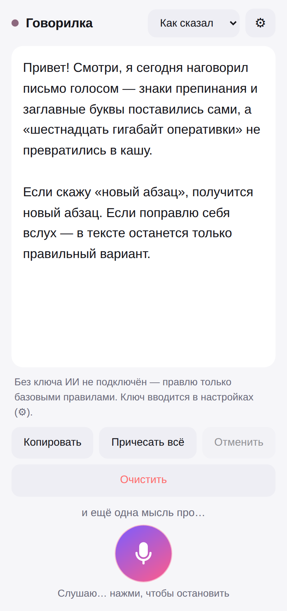

# Говорилка — пиши голосом, а не пальцами

**Открыть приложение: https://hammadismailov2015-wq.github.io/Pisatelstvo-/**

Нажимаешь микрофон, говоришь как думаешь — ИИ сам ставит знаки препинания и заглавные буквы,
убирает «э-э» и «ну как бы», исправляет ошибки распознавания **по смыслу фразы**, а не по звуку,
и понимает голосовые команды («новый абзац», «запятая», «в скобках»).

Исправлять руками ничего не нужно. Наговорил — скопировал — отправил.



## Что умеет

- **Правит на лету.** Пока ты говоришь дальше, предыдущая фраза уже превращается в готовый текст.
- **Понимает контекст.** Каждый кусок правится с оглядкой на то, что уже написано, поэтому текст
  получается связным, а расслышанные невпопад слова встают на место.
- **Слышит, когда ты поправил себя.** Сказал «нет, не в среду, а в пятницу» — в тексте останется
  только «в пятницу».
- **Голосовые команды:** «точка», «запятая», «двоеточие», «тире», «вопросительный знак»,
  «новый абзац», «новая строка» — ставятся знаками, а не пишутся словами.
- **Указания по ходу дела.** Скажи «перечисли списком» или «сделай короче» — ИИ сделает это с текстом,
  а само указание в текст не попадёт.
- **Стили:** «Как сказал», «Сообщение», «Деловое», «Пост», «Заметка».
- **Кнопка «Причесать всё»** — перечитывает весь текст целиком и приводит его в порядок.
- **Ставится на телефон как приложение** (PWA), работает офлайн-оболочкой, текст сохраняется сам,
  есть «Отменить», «Копировать» и «Поделиться».
- **Без ключа тоже работает** — тогда знаки расставляются простыми правилами, без ИИ.

## Быстрый старт

```bash
npm install
cp .env.example .env        # и вписать свой ключ ANTHROPIC_API_KEY
ANTHROPIC_API_KEY=sk-ant-... npm start
```

Открыть http://localhost:3000

Ключ берётся тут: https://console.anthropic.com → API Keys.

### Как открыть на телефоне

Голосовой ввод работает в **Chrome** (Android, компьютер) и в **Safari на iPhone** (iOS 14.5+).

1. Телефон и компьютер — в одной Wi-Fi сети.
2. Узнай адрес компьютера в сети (`hostname -I` на Linux, `ipconfig` на Windows) и открой
   на телефоне `http://АДРЕС:3000`.
3. В браузере: «Поделиться» → «На экран Домой». Появится иконка с микрофоном, приложение
   откроется во весь экран.

> Микрофон в браузере разрешён только на `localhost` и на `https://`. Если открываешь по локальному
> `http://`-адресу и телефон не даёт доступ к микрофону — выложи приложение на любой хостинг с https
> (Vercel, Netlify, Cloudflare Pages, свой сервер) либо прокинь туннель (`cloudflared tunnel --url http://localhost:3000`).

### Публичная ссылка (GitHub Pages)

Приложение публикуется само при пуше в `main` — workflow `.github/workflows/pages.yml`.
Один раз нужно включить Pages в репозитории:

1. **Settings** → **Pages** → **Build and deployment** → **Source**: выбрать **GitHub Actions**.
2. **Actions** → «Публикация на GitHub Pages» → **Run workflow** (или просто сделать любой пуш в `main`).

Через пару минут сайт будет доступен по адресу
`https://hammadismailov2015-wq.github.io/Pisatelstvo-/`.

На Pages сервера нет, поэтому правку текста включает свой ключ Claude API, введённый
в настройках приложения (⚙). Ключ хранится только в браузере того, кто его ввёл.

### Вариант без своего сервера

Папку `public/` можно просто положить на любой статический хостинг с https — и открыть настройки (⚙),
вписав туда свой ключ Claude API. Ключ хранится только в этом браузере (`localStorage`) и уходит
только на `api.anthropic.com`.

Это удобно для себя одного. Если приложением пользуется кто-то ещё — лучше поднять сервер с ключом
в переменной окружения: тогда ключ не покидает сервер.

## Как это устроено

```
server.js            маленький сервер: статика + POST /api/fix (ключ живёт здесь)
public/index.html    экран приложения
public/app.js        распознавание речи, очередь правки, автосохранение
public/prompt.js     промпты — одни и те же для сервера и для режима «свой ключ»
public/sw.js         service worker: оболочка открывается без сети
tools/make-icons.js  генератор иконок (npm run icons)
```

Речь распознаёт сам браузер (Web Speech API) — это бесплатно. К ИИ уходит только текст:
кусок распознанного + хвост уже написанного для контекста. Модель — `claude-opus-5`
с низким усилием (`effort: "low"`), чтобы правка приходила быстро; при отказе классификатора
включается серверный фолбэк, а текст в любом случае не теряется — в худшем случае он попадёт
в поле как есть.

## Настройки (⚙)

| Настройка | Что делает |
|---|---|
| Язык распознавания | Русский, English, Українська, Қазақша, Deutsch, Español |
| Постоянное указание | Например «пиши коротко и без смайликов» — учитывается при каждой правке |
| Править на лету | Выключи, если хочешь сначала наговорить всё, а потом нажать «Причесать всё» |
| Свой ключ Claude API | Нужен, только если сервер запущен без ключа |

## Сколько стоит

Платится только правка текста (распознавание бесплатное). Тарифы Claude API — на
https://www.anthropic.com/pricing. Реплики короткие, так что обычная переписка стоит копейки;
если хочется дешевле — выключи «Править на лету» и жми «Причесать всё» один раз в конце.
